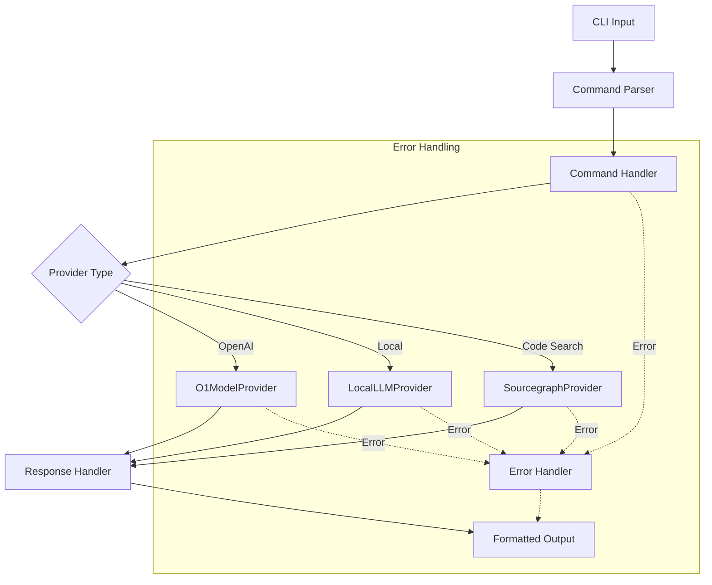
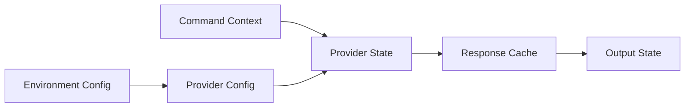

# Command Flow Map

## CLI Command Flow

## State Management Flow

## Key Interactions
1. Command Parser validates and routes commands
2. Command Handler manages execution flow
3. Provider selection based on command and config
4. Response handling and formatting
5. Error propagation and handling
6. State management and caching
