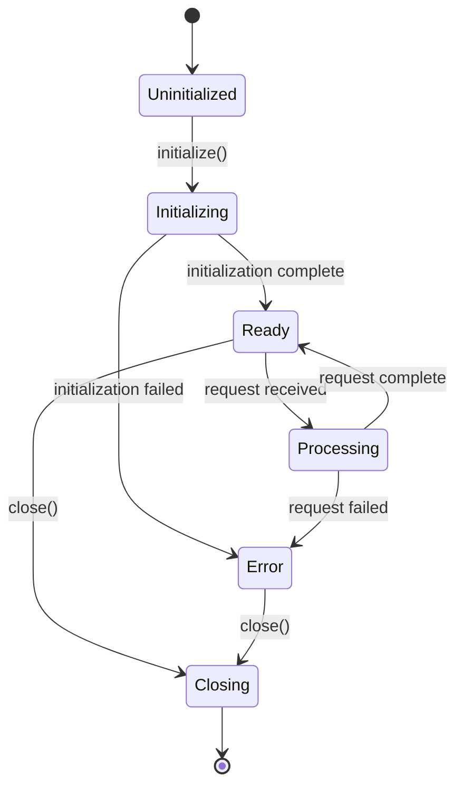
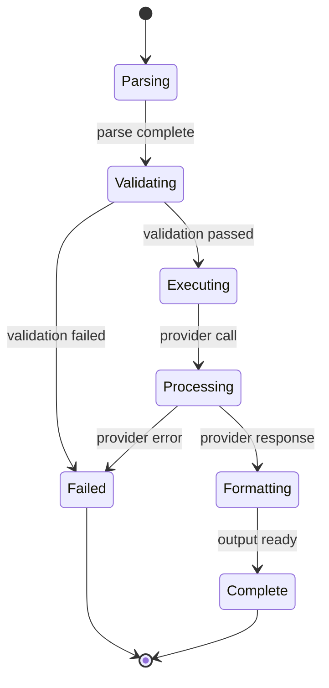
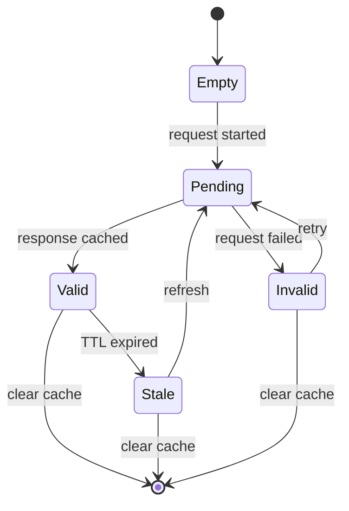

# Component Lifecycle Map

## Provider Lifecycle

## Command Lifecycle

## Cache Entry Lifecycle

## Key Lifecycle Events
1. Provider initialization and shutdown
2. Command execution flow
3. Cache entry management
4. Error handling states
5. Resource cleanup
6. State transitions
