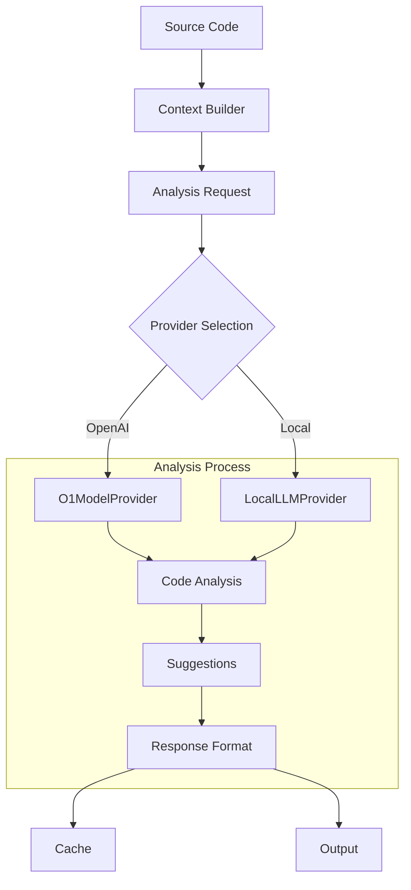
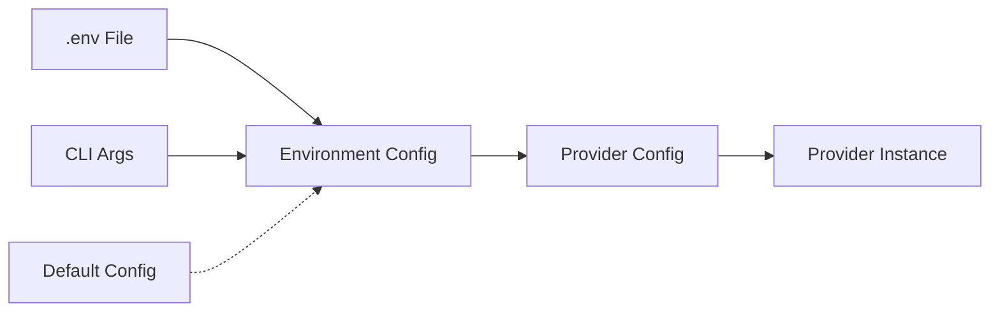
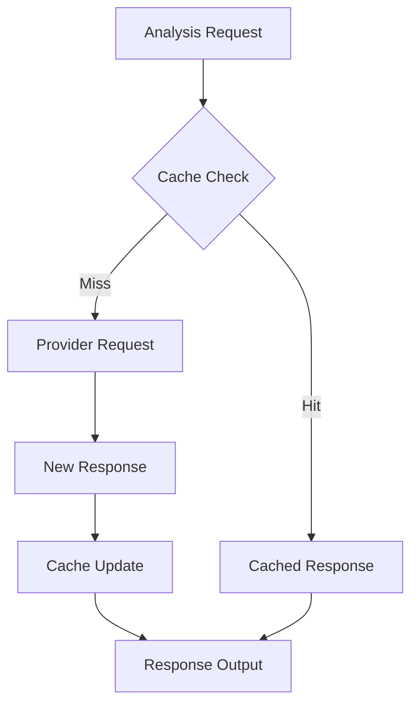

# Data Flow Map

## Code Analysis Flow

## Configuration Flow

## Cache Management

## Key Data Flows
1. Code analysis request processing
2. Configuration management
3. Cache utilization
4. Response handling
5. Error propagation
6. State persistence
