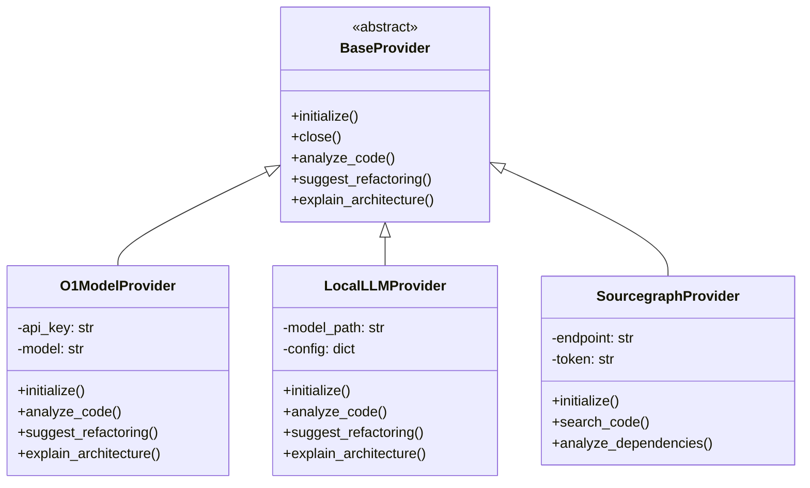
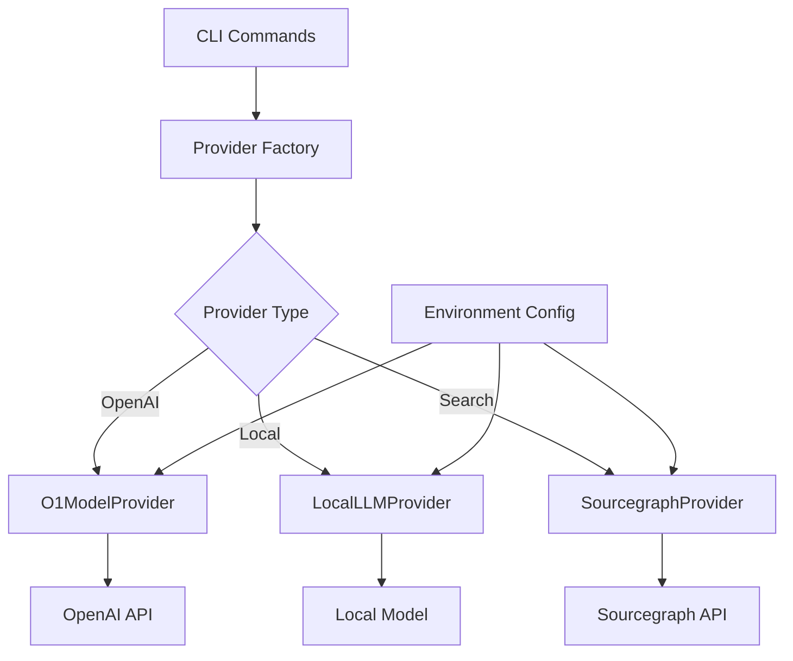

# Provider Relationships Map

## Provider Hierarchy

## Provider Dependencies

## Key Relationships
1. All providers inherit from BaseProvider
2. Provider Factory manages instantiation
3. Environment config influences all providers
4. Each provider has unique dependencies
5. Providers can be used independently
6. Cross-provider functionality supported
